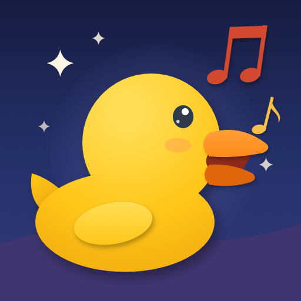
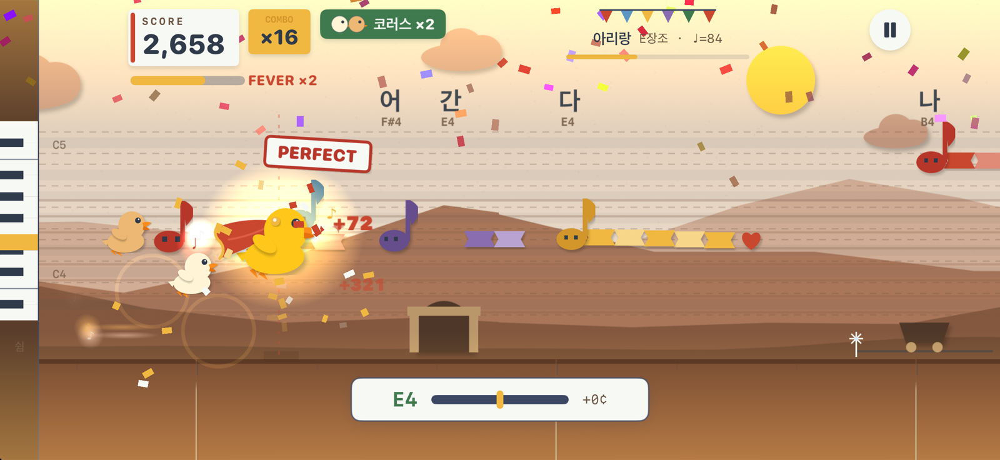
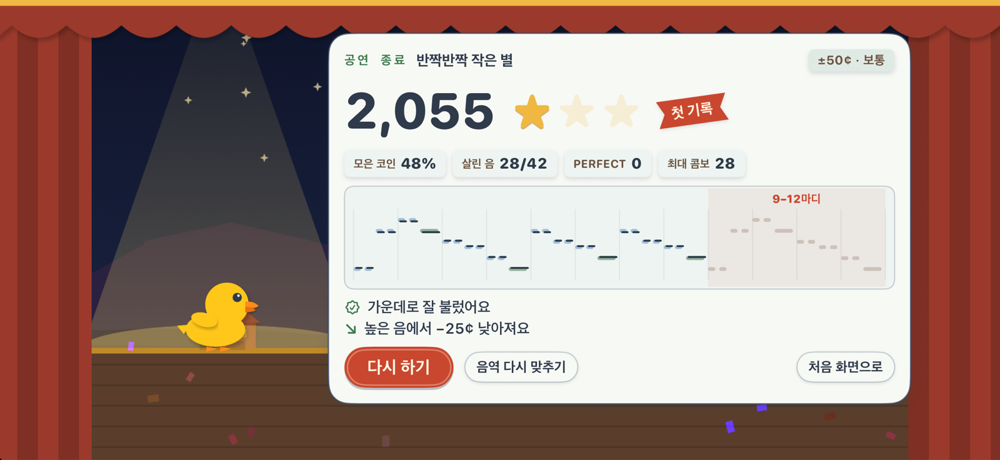

<div align="center">
  
  <h1>Pitch Perfect</h1>
  <p><strong>노래하면, 날아요.</strong></p>
  <p>목소리의 음정으로 종이 아기 오리를 날리는 Mac 노래 게임.</p>
  <p>macOS 14 이상 · Apple Silicon & Intel · 0.1.3 Preview</p>
  <p><a href="#설치">설치</a> · <a href="#이렇게-놀아요">이렇게 놀아요</a> · <a href="https://github.com/sean-lab/homebrew-pitchperfect/releases">다운로드</a> · <a href="README.md">English</a></p>
</div>



## 이렇게 놀아요

Mac의 마이크에 대고 노래하세요. 오리가 내 음정을 따라 오르내리고, 음을 길게 유지하면 코인을 모읍니다. 위에는 가사와 음이름이 함께 흘러가고, 다음 음표에 링이 줄어들며 시작 순간을 알려 줍니다.

| 부르기 | 함께 | 돌아보기 |
| :--- | :--- | :--- |
| 처음에 '아—' 한 번이면 곡을 내 음역에 맞춥니다. 한 옥타브 높거나 낮게 불러도 같은 음으로 쳐요. | 콤보가 이어지면 코러스 친구들이 날아와 화음을 넣습니다. 게이지가 차면 망토를 두른 슈퍼 오리가 되어 점수가 두 배인 피버. | 곡이 끝나면 커튼콜 무대에서 별과 최고 기록, 음표 위에 내가 부른 음을 겹친 그래프, 그리고 "조금 높게 부르는 편", "높은 음에서 낮아져요", "음을 조금 늦게 잡아요" 같은 한두 줄. |

**내장 곡 13곡.** 우리 민요와 세계 민요·동요·찬송가·캐럴로, 멜로디와 가사 모두 저작권이 만료된 곡이며 밴드·오케스트라·피아노 반주가 붙습니다. 찬송가 두 곡에는 알토·테너·베이스 파트가 있어 합창 파트 연습에도 좋습니다.

**내 스테이지 만들기.** MusicXML 악보를 가져오거나(합창 악보는 성부마다 파트가 됨), 건반 격자에 음표를 그리거나, 노래로 불러서 악보를 받아 적게 할 수 있습니다.



## 설치

```sh
brew install --cask sean-lab/pitchperfect/pitch-perfect
```

**macOS 14 Sonoma 이상**에서 동작하며, 하나의 앱으로 **Apple Silicon과 Intel Mac**을 지원합니다.

직접 설치하려면 [Releases](https://github.com/sean-lab/homebrew-pitchperfect/releases)에서 ZIP을 내려받아 압축을 풀고 `Pitch Perfect.app`을 응용 프로그램 폴더로 옮기세요.

> **Preview 릴리스:** 0.1.3은 ad-hoc 서명만 되어 있고 Apple 공증을 받지 않았습니다. 처음 열 때 **시스템 설정 → 개인정보 보호 및 보안**에서 허용이 필요할 수 있습니다. 이 cask는 Gatekeeper를 우회하거나 보안 설정을 바꾸지 않습니다.

**노래 팁.** 이어폰을 쓰면 반주가 마이크에 섞이지 않아 판정이 정확해집니다. MacBook 뚜껑을 닫아 두면 내장 마이크가 꺼지니, 뚜껑을 열거나 음역 맞추기 카드의 "마이크 바꾸기"에서 다른 마이크를 고르세요.

## 업데이트

```sh
brew update
brew upgrade --cask sean-lab/pitchperfect/pitch-perfect
```

삭제:

```sh
brew uninstall --cask pitch-perfect
```

기록과 설정, 내가 만든 스테이지는 남습니다. 함께 지우려면 `brew uninstall --cask --zap pitch-perfect`를 쓰세요.

## 목소리는 내 Mac 안에서만

Pitch Perfect는 노래하는 동안에만 소리를 듣고 Mac 안에서 분석합니다. 녹음 파일을 남기거나, 업로드하거나, 계정을 만들지 않습니다.

## 크레딧

밴드·오케스트라 소리는 S. Christian Collins의 [GeneralUser GS](https://schristiancollins.com/generaluser.php)를 씁니다(라이선스를 앱에 함께 담았습니다). 내장 곡의 멜로디와 가사는 모두 저작권이 만료되었습니다.

<p align="center"></p>
